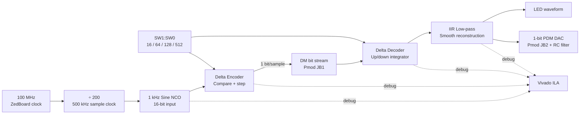

# One Bit. Real Signal. Full FPGA. ⚡

<p align="center">
  <strong>A live Delta Modulation lab on the ZedBoard — built to be seen, measured, and explained.</strong><br>
  1 kHz sine wave → 1-bit stream → reconstructed waveform → LEDs, Pmod, oscilloscope, and ILA.
</p>

<p align="center">
  
  
  
</p>

> **The challenge:** Can you transmit a waveform using only `0` and `1`?  
> **The answer:** Yes — if every bit says *go up* or *go down*.

---

## Why this project gets attention

Most delta-modulation projects stop at a simulation graph. This one lets people **watch the theory fail and recover on real hardware**.

| Flip the switches | What happens | What the audience sees |
|---|---|---|
| `00` → `delta = 16` | The staircase cannot climb quickly enough. | **Slope overload** — the signal falls behind. |
| `01` → `delta = 64` | It improves, but still misses steep slopes. | Tracking gets closer, but not clean. |
| `10` → `delta = 128` | The design point. | A clean reconstructed sine on LEDs/ILA/scope. ✅ |
| `11` → `delta = 512` | Steps become too large. | **Granular noise** — it chases the signal in coarse jumps. |

It is not just an FPGA encoder. It is a hands-on experiment in the core trade-off of digital communication: **speed versus accuracy**.

## 30-second demo

1. Open `DCS/delta/delta.xpr` in Vivado and program the included bitstream.
2. Press **BTNC** to reset the signal chain.
3. Set `SW1:SW0 = 10` — LEDs begin representing the reconstructed sine.
4. Put a scope on **Pmod JB1** to see the raw 500 kbit/s one-bit stream.
5. Put an RC filter on **Pmod JB2** and watch a smooth analog-like sine return.
6. Flip the switches and make slope overload and granular noise appear on demand.

That is the whole story of delta modulation — visible in seconds.

---

## The signal journey



### One bit does all the work

```text
input above staircase?  → send 1 → move estimate UP by delta
input below staircase?  → send 0 → move estimate DOWN by delta
```

The receiver follows the same `UP/DOWN` instructions. A lightweight IIR filter removes the staircase edges and reveals the original waveform.

---

## The math behind the magic

For each sample `x[n]`, the encoder decides:

```text
b[n] = 1 if x[n] >= y[n-1], otherwise 0
y[n] = y[n-1] + delta  when b[n] = 1
        y[n-1] - delta  when b[n] = 0
```

The decoder repeats the same up/down integration and smooths it using:

```text
filtered[n] = filtered[n-1] + (staircase[n] - filtered[n-1]) / 32
```

For a sine wave, the minimum step needed to avoid slope overload is:

```text
delta >= 2π × frequency × amplitude / sample_rate
```

For this build:

```text
2π × 1000 Hz × 8192 / 500000 Hz = 102.94
```

That is why **128 wins**. It is large enough to chase the sine, but small enough to avoid ugly coarse steps.

---

## What is actually implemented?

| Feature | Reality check |
|---|---|
| Input waveform | Internal 1 kHz sine, 16-bit signed, amplitude ±8191. |
| Sampling rate | 500 kHz from the 100 MHz board oscillator. |
| Output stream | One bit per sample = **500 kbit/s** raw DM stream. |
| Reconstruction | Delta decoder + first-order IIR low-pass filter. |
| Hardware outputs | LEDs, Pmod JB1 raw stream, Pmod JB2 PDM/DAC output. |
| Debug | Internal input, staircases, error, and bitstream marked for ILA. |
| Numeric safety | Saturating signed accumulators; no silent wraparound. |
| Evidence | Saved simulation CSV, timing report, utilization, power, DRC, `.bit`, and `.ltx` are versioned. |

### Saved result snapshot

| Nominal setting: `delta = 128` | Result |
|---|---:|
| Input range | -8191 to +8191 |
| Captured samples | 4096 |
| Encoder SNR | **33.16 dB** |
| Encoder RMS error | 126.90 counts |
| Maximum error | 322 counts |
| Timing failures | **0** |
| Routing errors | **0** |

> The final placed design uses 1500 LUTs, 2351 registers, and 8 BRAM tiles because the captured build includes a powerful ILA/debug hub. The delta-modulation core itself synthesizes to only **183 LUTs and 110 registers**.

---

## Run it your way

### Path A — simulate and plot

Best when you want fast waveforms, CSV data, and graphs.

```text
Vivado → Open DCS/delta/delta.xpr
       → Run Behavioral Simulation
       → Run All
       → inspect waveform + dm_out.csv
```

The testbench captures 4096 samples and writes:

```text
n,input,encoder_staircase,dm_bit,decoder_staircase,decoder_filtered,error
```

Try `DELTA = 16, 64, 128, 512` in `DCS/tb_dm.v` and plot the difference. It is the fastest way to build a compelling result figure for a report or presentation.

### Path B — program the board

Best when you want the live “wow” moment.

```text
Vivado → Open DCS/delta/delta.xpr
       → Generate Bitstream
       → Hardware Manager
       → Program Device
```

The generated release image is already available here:

```text
DCS/delta/delta.runs/impl_1/dm_top.bit
```

Connect JB2 through a **1 kΩ series resistor** and **100 nF capacitor to ground**. Probe across the capacitor to view the reconstructed waveform safely on a scope.

### Path C — explore the math in software

`DCS/delta_mod.c` is a Cortex-A9 / Vitis reference model. It prints CSV and SNR values for all four delta steps over UART at `115200-8-N-1`.

---

## Hardware map

| On the ZedBoard | Function |
|---|---|
| 100 MHz oscillator (`Y9`) | Main FPGA clock |
| BTNC (`P16`) | Active-high reset |
| SW0 / SW1 (`F22` / `G22`) | Step-size selection |
| LD0–LD7 | Reconstructed waveform visualization |
| Pmod JB1 (`W12`) | Raw one-bit delta-modulated data |
| Pmod JB2 (`W11`) | One-bit PDM/DAC reconstruction output |

> ⚠️ **Board check before programming:** `DCS/zedboard_dm.xdc` assumes the ZedBoard J18 VADJ jumper is at its factory 1.8 V setting. If it is set to 3.3 V, change the BTNC and switch constraints from `LVCMOS18` to `LVCMOS33` before implementation.

---

## Repository map

```text
DCS/
├── dm_top.v                 ← the ZedBoard top level
├── sine_gen.v               ← 32-bit phase accumulator + sine ROM
├── delta_modulator.v        ← one-bit encoder
├── delta_demodulator.v      ← one-bit decoder + IIR filter
├── tb_dm.v                  ← simulation, VCD, CSV capture
├── zedboard_dm.xdc          ← board pins and clocks
├── delta_mod.c              ← optional Cortex-A9/Vitis reference model
├── delta/delta.xpr          ← ✅ main Vivado project
└── Deltamodulation/         ← ⚠️ earlier experimental failure-case project
```

### Important: choose the right Vivado project

Open **`DCS/delta/delta.xpr`** for the real board project. It includes the hardware top level, XDC constraints, saved implementation evidence, ILA probes, and deployable bitstream.

`DCS/Deltamodulation/Deltamodulation.xpr` is intentionally retained as a learning artifact. Its saved simulation reports slope overload, it has no board constraints, and its design top is a testbench. It is useful for comparison — not for deployment.

---

## Why this is different from the usual project

```text
Typical classroom project                  This repository
─────────────────────────                  ───────────────
Only a simulation graph               →    Real ZedBoard bitstream
One hidden parameter                  →    Live switch-controlled failure modes
Input/output only                     →    Full ILA visibility inside the codec
Ideal analog plot                     →    Physical Pmod signal + RC reconstruction
No reproducible evidence              →    CSV, timing, utilization, power, DRC reports
```

This is not presented as a new modulation algorithm. Its strength is **turning a classic communications concept into an honest, debuggable, board-level demonstration**.

---

## Paper, presentation, and viva toolkit

The full ready-to-edit academic report is here:

➡️ **[Open PROJECT_REPORT.md](PROJECT_REPORT.md)**

It already contains:

- Abstract, aim, objectives, problem statement, theory, architecture, and logic flow
- Detailed procedure for simulation, hardware demonstration, and Vitis reference run
- Observation/result tables and saved implementation evidence
- “How this differs from other projects,” limitations, future work, conclusion, and references
- A figure checklist for the exact screenshots that make a submission look complete

### A strong presentation sequence

1. Start with: “Can a waveform travel using only one bit?”
2. Show the `delta = 128` clean reconstruction.
3. Flip to `delta = 16` and let the audience see slope overload happen.
4. Flip to `delta = 512` and explain granular noise.
5. Open the ILA to prove the LED/scope behavior originates in the actual hardware data path.
6. End with the resource result: 183 LUTs for the core, yet a complete visible communication experiment.

---

## Honest limitations — and your next upgrade

- The current input is an internal sine wave, not live microphone/audio data.
- JB2 is a one-bit PDM signal; an RC filter is required for analog observation.
- Button/switch debounce and full clock-domain hardening are future production improvements.
- The fixed-step encoder is ideal for learning; adaptive delta modulation is the natural next research step.

### Take it further

- Add a microphone/ADC input.
- Stream FPGA samples to the Zynq PS over AXI/UART.
- Build adaptive/CVSD delta modulation.
- Compare DM, PCM, and DPCM by SNR, bandwidth, and FPGA resource cost.
- Add a live dashboard for error and bit-run statistics.

---

## Prerequisites

- **Vivado 2022.2** (the included artifacts were generated with this version)
- ZedBoard (XC7Z020-1CLG484), JTAG connection, and power supply
- Optional oscilloscope, jumper wires, 1 kΩ resistor, and 100 nF capacitor
- Optional Vitis Zynq standalone platform for `delta_mod.c`

## Notes for contributors

Vivado caches, temporary files, and generated run folders are intentionally ignored. The repository deliberately versions the source, project definitions, bitstream/debug probes, selected implementation evidence, and nominal simulation CSV needed to understand and demonstrate the project.

---

<p align="center">
  <strong>From a single bit to a visible waveform — that is the entire project.</strong><br>
  If you build or extend it, share an ILA trace or scope capture. That is where this demo really comes alive. 🚀
</p>
