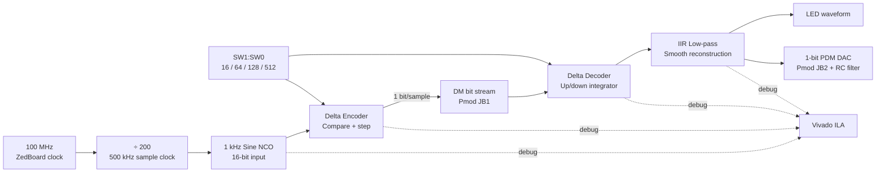

# FPGA-Based Delta Modulation and Demodulation System on ZedBoard ⚡

<p align="center">
  <strong>A live Delta Modulation lab on the ZedBoard — built to be seen, measured, and explained.</strong><br>
  1 kHz sine wave → 1-bit stream → reconstructed waveform → LEDs, Pmod, oscilloscope, and ILA.
</p>

<p align="center">
  
  
  
</p>

> **The challenge:** Can you transmit a waveform using only `0` and `1`?  
> **The answer:** Yes — if every bit says *go up* or *go down*.

---

## Why this project gets attention

Most delta-modulation projects stop at a simulation graph. This one lets people **watch the theory fail and recover on real hardware**.

| Flip the switches | What happens | What the audience sees |
|---|---|---|
| `00` → `delta = 16` | The staircase cannot climb quickly enough. | **Slope overload** — the signal falls behind. |
| `01` → `delta = 64` | It improves, but still misses steep slopes. | Tracking gets closer, but not clean. |
| `10` → `delta = 128` | The design point. | A clean reconstructed sine on LEDs/ILA/scope. ✅ |
| `11` → `delta = 512` | Steps become too large. | **Granular noise** — it chases the signal in coarse jumps. |

It is not just an FPGA encoder. It is a hands-on experiment in the core trade-off of digital communication: **speed versus accuracy**.

## 30-second demo

1. Open `DCS/delta/delta.xpr` in Vivado and program the included bitstream.
2. Press **BTNC** to reset the signal chain.
3. Set `SW1:SW0 = 10` — LEDs begin representing the reconstructed sine.
4. Put a scope on **Pmod JB1** to see the raw 500 kbit/s one-bit stream.
5. Put an RC filter on **Pmod JB2** and watch a smooth analog-like sine return.
6. Flip the switches and make slope overload and granular noise appear on demand.

That is the whole story of delta modulation — visible in seconds.

---

## The signal journey



### One bit does all the work

```text
input above staircase?  → send 1 → move estimate UP by delta
input below staircase?  → send 0 → move estimate DOWN by delta
```

The receiver follows the same `UP/DOWN` instructions. A lightweight IIR filter removes the staircase edges and reveals the original waveform.

---

## The math behind the magic

For each sample `x[n]`, the encoder decides:

```text
b[n] = 1 if x[n] >= y[n-1], otherwise 0
y[n] = y[n-1] + delta  when b[n] = 1
        y[n-1] - delta  when b[n] = 0
```

The decoder repeats the same up/down integration and smooths it using:

```text
filtered[n] = filtered[n-1] + (staircase[n] - filtered[n-1]) / 32
```

For a sine wave, the minimum step needed to avoid slope overload is:

```text
delta >= 2π × frequency × amplitude / sample_rate
```

For this build:

```text
2π × 1000 Hz × 8192 / 500000 Hz = 102.94
```

That is why **128 wins**. It is large enough to chase the sine, but small enough to avoid ugly coarse steps.

---

## What is actually implemented?

| Feature | Reality check |
|---|---|
| Input waveform | Internal 1 kHz sine, 16-bit signed, amplitude ±8191. |
| Sampling rate | 500 kHz from the 100 MHz board oscillator. |
| Output stream | One bit per sample = **500 kbit/s** raw DM stream. |
| Reconstruction | Delta decoder + first-order IIR low-pass filter. |
| Hardware outputs | LEDs, Pmod JB1 raw stream, Pmod JB2 PDM/DAC output. |
| Debug | Internal input, staircases, error, and bitstream marked for ILA. |
| Numeric safety | Saturating signed accumulators; no silent wraparound. |
| Evidence | Saved simulation CSV, timing report, utilization, power, DRC, `.bit`, and `.ltx` are versioned. |

### Saved result snapshot

| Nominal setting: `delta = 128` | Result |
|---|---:|
| Input range | -8191 to +8191 |
| Captured samples | 4096 |
| Encoder SNR | **33.16 dB** |
| Encoder RMS error | 126.90 counts |
| Maximum error | 322 counts |
| Timing failures | **0** |
| Routing errors | **0** |

> The final placed design uses 1500 LUTs, 2351 registers, and 8 BRAM tiles because the captured build includes a powerful ILA/debug hub. The delta-modulation core itself synthesizes to only **183 LUTs and 110 registers**.

---

## Run it anywhere — choose your path

| You have... | Best path | What you get |
|---|---|---|
| Only a laptop | **Icarus Verilog** | Portable simulation, VCD waveform, and CSV data on Windows/Linux/macOS. |
| Vivado, but no board | **Vivado behavioral simulation** | XSIM waveforms and the exact project configuration used for the FPGA build. |
| Vivado + ZedBoard | **Hardware demo** | LEDs, raw Pmod stream, RC-filtered reconstruction, and ILA capture. |
| Vitis + ZedBoard | **Cortex-A9 model** | UART CSV/SNR comparison from the Zynq processing system. |

> **Start here if you downloaded `FPGA.zip`:** extract it, open a terminal in the extracted project folder, and follow Path A. No board or Vivado installation is needed for the portable simulation.

### 0. Get a clean copy

#### Option 1 — clone from GitHub

```bash
git clone https://github.com/Mithunjagan/DCS_DM.git
cd DCS_DM
```

#### Option 2 — use the ZIP file

1. Extract `FPGA.zip` to a folder with write permission, for example `C:\Projects\DCS_DM` or `~/Projects/DCS_DM`.
2. Open PowerShell, Command Prompt, or a terminal **at the folder containing `README.md`**.
3. Confirm that `DCS/tb_dm.v` exists before running a simulator.

---

### Path A — run the design on Windows, Linux, or macOS with Icarus Verilog

This is the most portable route. It tests the actual encoder, decoder, sine source, and CSV-writing testbench. It does not require Vivado, a license, or the ZedBoard.

#### A.1 Install the simulator

Install [Icarus Verilog](https://steveicarus.github.io/iverilog/) so both `iverilog` and `vvp` are available on your terminal path.

| Operating system | Typical installation method |
|---|---|
| Windows | Install Icarus Verilog and reopen PowerShell. Verify with `iverilog -V`. |
| Ubuntu/Debian | `sudo apt install iverilog` |
| Fedora | `sudo dnf install iverilog` |
| macOS | `brew install icarus-verilog` |

#### A.2 Compile and run — PowerShell on Windows

Run the included script from the repository root:

```powershell
.\scripts\run_icarus.ps1 -Delta 128 -Samples 4096
```

If Windows blocks local PowerShell scripts because of its execution policy, use this one-time invocation instead:

```powershell
powershell -ExecutionPolicy Bypass -File .\scripts\run_icarus.ps1 -Delta 128 -Samples 4096
```

For a manual compile, use:

```powershell
New-Item -ItemType Directory -Force build\sim | Out-Null
Push-Location build\sim
iverilog -g2012 -s tb_dm -Ptb_dm.DELTA=128 -Ptb_dm.N=4096 -o tb_dm.vvp `
  ..\..\DCS\sine_gen.v `
  ..\..\DCS\delta_modulator.v `
  ..\..\DCS\delta_demodulator.v `
  ..\..\DCS\tb_dm.v
vvp .\tb_dm.vvp
Pop-Location
```

#### A.3 Compile and run — Linux/macOS shell

Run the included portable script from the repository root:

```bash
sh ./scripts/run_icarus.sh 128 4096
```

The first argument is the delta step; the optional second argument is the sample count. For example, run the granular-noise case with:

```bash
sh ./scripts/run_icarus.sh 512 8192
```

For a manual compile, use:

```bash
mkdir -p build/sim
cd build/sim
iverilog -g2012 -s tb_dm -Ptb_dm.DELTA=128 -Ptb_dm.N=4096 -o tb_dm.vvp \
  ../../DCS/sine_gen.v \
  ../../DCS/delta_modulator.v \
  ../../DCS/delta_demodulator.v \
  ../../DCS/tb_dm.v
vvp tb_dm.vvp
cd ../..
```

#### A.4 Confirm success

The simulator should print a completion message similar to:

```text
TB done: 4096 samples written to dm_out.csv (delta=128)
```

You should now have these two files in `build/sim/`:

```text
dm_out.csv   ← open in Excel, Python, MATLAB, or LibreOffice Calc
tb_dm.vcd    ← open with GTKWave or another VCD viewer
```

The CSV columns are:

```text
n,input,encoder_staircase,dm_bit,decoder_staircase,decoder_filtered,error
```

#### A.5 Create your own result figures

1. Run the script once for each supported delta value; no HDL edit is needed:

   ```powershell
   .\scripts\run_icarus.ps1 -Delta 16
   .\scripts\run_icarus.ps1 -Delta 64
   .\scripts\run_icarus.ps1 -Delta 128
   .\scripts\run_icarus.ps1 -Delta 512
   ```

   ```bash
   sh ./scripts/run_icarus.sh 16
   sh ./scripts/run_icarus.sh 64
   sh ./scripts/run_icarus.sh 128
   sh ./scripts/run_icarus.sh 512
   ```

2. Each runner creates a separate folder: `build/sim/delta-16/`, `delta-64/`, `delta-128/`, or `delta-512/`.
3. Plot `input`, `encoder_staircase`, and `decoder_filtered` against `n`.
4. Plot `error` separately, or compare the density and consecutive-run lengths of `dm_bit = 0/1` values.

> The testbench is intentionally independent of the board top level. `DCS/bufg_stub.v` is only needed when simulating a design that instantiates the Xilinx `BUFG` primitive; it is **not** part of the command above.

---

### Path B — run the official Vivado simulation

Use this path to work with the saved Xilinx project, inspect all signals in XSIM, and reproduce the workflow used to generate the supplied implementation evidence.

#### B.1 Prerequisites

- AMD/Xilinx Vivado **2022.2** is the matched version for the saved project artifacts.
- Later Vivado versions can open the project, but may ask to upgrade it. If you want to preserve the original project metadata, use **Save Project As** in a separate working copy.

#### B.2 Open and validate the project

1. Launch Vivado.
2. Select **File → Open Project**.
3. Open `DCS/delta/delta.xpr` — **not** `DCS/Deltamodulation/Deltamodulation.xpr`.
4. In the **Sources** pane, verify that the design source set contains `dm_top.v`, `sine_gen.v`, `delta_modulator.v`, and `delta_demodulator.v`.
5. Verify that the simulation top is `tb_dm` and the design top is `dm_top`.
6. If Vivado reports missing source files, confirm that the repository was extracted intact. The `.xpr` intentionally references the HDL files one directory above `DCS/delta/`.

#### B.3 Run the behavioral simulation

1. In **Flow Navigator**, choose **Run Simulation → Run Behavioral Simulation**.
2. In XSIM, add or locate these signals: `x`, `y_enc`, `dm_bit`, `y_dec_stair`, `y_dec`, and `x - y_enc`.
3. Click **Run All**. Do not stop after the default short waveform interval; the testbench automatically ends after 4096 samples.
4. Confirm the `TB done` completion message in the Tcl/simulation console.
5. Open the generated `dm_out.csv`. Vivado commonly writes it under `DCS/delta/delta.sim/sim_1/behav/xsim/` for this saved project.

#### B.4 Build from HDL source

1. Select **Run Synthesis** and wait for completion.
2. Open the synthesized design and check for unintended inferred logic or missing ports.
3. Select **Run Implementation**.
4. Open **Report Timing Summary**; the acceptance condition is zero failing setup/hold endpoints.
5. Run **Generate Bitstream** only after implementation completes successfully.
6. Save the generated `.bit` and matching `.ltx` probe file together if you plan to use ILA.

---

### Path C — run the live ZedBoard demonstration

This is the hardware path used for the presentation/demo experience.

#### C.1 Hardware checklist

- ZedBoard with XC7Z020-1CLG484
- Board power supply and JTAG connection
- Vivado Hardware Manager
- Optional oscilloscope and Pmod jumper wires
- Optional RC filter: **1 kΩ series resistor + 100 nF capacitor to ground**

#### C.2 Validate the board voltage setting first

`DCS/zedboard_dm.xdc` declares the slide switches and BTNC as `LVCMOS18`, because it assumes the ZedBoard J18 VADJ jumper is at the factory 1.8 V position.

1. Power off the board.
2. Check J18 against your ZedBoard hardware guide.
3. If J18 is at 1.8 V, use the supplied XDC unchanged.
4. If J18 is at 3.3 V, change **only** the BTNC and switch constraints in `DCS/zedboard_dm.xdc` from `LVCMOS18` to `LVCMOS33`, then rebuild the bitstream.

Do not program the board with incompatible I/O standards.

#### C.3 Program the included bitstream

1. Power the ZedBoard and connect JTAG.
2. Open `DCS/delta/delta.xpr` in Vivado.
3. Select **Open Hardware Manager → Open Target → Auto Connect**.
4. Select **Program Device**.
5. Choose `DCS/delta/delta.runs/impl_1/dm_top.bit`.
6. If Vivado asks for debug probes, choose the matching `DCS/delta/delta.runs/impl_1/dm_top.ltx`.
7. Program the device and wait for success confirmation.

#### C.4 Run the demo

1. Press **BTNC** to reset the codec.
2. Set `SW1:SW0 = 10` for `delta = 128`.
3. Observe the LED pattern changing as the reconstructed signal changes.
4. Probe **Pmod JB1** for the raw 500 kbit/s DM stream.
5. Connect **Pmod JB2 → 1 kΩ resistor → measurement node**. Connect a **100 nF capacitor from that node to GND**. Probe the measurement node to see the filtered reconstruction.
6. Change to `00`, `01`, and `11`; record the effect in the ILA/scope capture.

#### C.5 Capture internal signals with ILA

1. In Hardware Manager, locate the ILA dashboard after programming the matching `.bit`/`.ltx` pair.
2. Use `dbg_bit` or an input zero-crossing as a trigger.
3. Capture `dbg_x`, `dbg_yenc`, `dbg_ydec`, `dbg_err`, and `dbg_bit`.
4. Export or screenshot the trace for your report. Capture one screenshot for `delta=128`, one for slope overload, and one for granular noise.

---

### Path D — run the Zynq Cortex-A9 reference model

This path does not use the FPGA logic. It is a numerical/software reference that prints the same core experiment as CSV over UART.

1. Install/open AMD/Xilinx Vitis with a Zynq standalone/BSP platform for the ZedBoard.
2. Create a standalone application project, for example from the `hello_world` template.
3. Replace the template C source with `DCS/delta_mod.c`.
4. Build the application. The source requires the Xilinx BSP headers and the math library supplied by the Vitis standalone environment.
5. Run it on the Cortex-A9 processor.
6. Open a USB-UART terminal at **115200 baud, 8 data bits, no parity, 1 stop bit**.
7. Capture the four CSV blocks (`delta = 16, 64, 128, 512`) and their printed SNR values.

### Fast troubleshooting

| Symptom | Likely cause | Fix |
|---|---|---|
| `iverilog` is not recognized | Simulator is not installed or not on `PATH`. | Install Icarus Verilog, reopen the terminal, and run `iverilog -V`. |
| No `dm_out.csv` | The simulation did not reach `$finish`, or it was run from another working folder. | Use `Run All`/`vvp`, then search the simulator working directory. |
| Vivado cannot find HDL files | The folder hierarchy changed after extraction. | Keep `DCS/delta/delta.xpr` directly beneath `DCS/` with the HDL files in `DCS/`. |
| LEDs do not behave as expected | Incorrect switch mode or reset state. | Press BTNC, then begin with `SW1:SW0 = 10`. |
| No scope reconstruction on JB2 | No RC filter, incorrect ground, or probing before the capacitor. | Use the documented 1 kΩ/100 nF network and common ground. |
| ILA is missing | `.ltx` probes do not match the bitstream. | Program the committed `dm_top.bit` and matching `dm_top.ltx` together, or regenerate both. |
| Input switches misbehave | J18 voltage and XDC I/O standard do not match. | Recheck the board jumper and `LVCMOS18`/`LVCMOS33` setting. |

---

## Hardware map

| On the ZedBoard | Function |
|---|---|
| 100 MHz oscillator (`Y9`) | Main FPGA clock |
| BTNC (`P16`) | Active-high reset |
| SW0 / SW1 (`F22` / `G22`) | Step-size selection |
| LD0–LD7 | Reconstructed waveform visualization |
| Pmod JB1 (`W12`) | Raw one-bit delta-modulated data |
| Pmod JB2 (`W11`) | One-bit PDM/DAC reconstruction output |

> ⚠️ **Board check before programming:** `DCS/zedboard_dm.xdc` assumes the ZedBoard J18 VADJ jumper is at its factory 1.8 V setting. If it is set to 3.3 V, change the BTNC and switch constraints from `LVCMOS18` to `LVCMOS33` before implementation.

---

## Repository map

```text
DCS/
├── dm_top.v                 ← the ZedBoard top level
├── sine_gen.v               ← 32-bit phase accumulator + sine ROM
├── delta_modulator.v        ← one-bit encoder
├── delta_demodulator.v      ← one-bit decoder + IIR filter
├── tb_dm.v                  ← simulation, VCD, CSV capture
├── zedboard_dm.xdc          ← board pins and clocks
├── delta_mod.c              ← optional Cortex-A9/Vitis reference model
├── delta/delta.xpr          ← ✅ main Vivado project
└── Deltamodulation/         ← ⚠️ earlier experimental failure-case project
```

### Important: choose the right Vivado project

Open **`DCS/delta/delta.xpr`** for the real board project. It includes the hardware top level, XDC constraints, saved implementation evidence, ILA probes, and deployable bitstream.

`DCS/Deltamodulation/Deltamodulation.xpr` is intentionally retained as a learning artifact. Its saved simulation reports slope overload, it has no board constraints, and its design top is a testbench. It is useful for comparison — not for deployment.

---

## Why this is different from the usual project

```text
Typical classroom project                  This repository
─────────────────────────                  ───────────────
Only a simulation graph               →    Real ZedBoard bitstream
One hidden parameter                  →    Live switch-controlled failure modes
Input/output only                     →    Full ILA visibility inside the codec
Ideal analog plot                     →    Physical Pmod signal + RC reconstruction
No reproducible evidence              →    CSV, timing, utilization, power, DRC reports
```

This is not presented as a new modulation algorithm. Its strength is **turning a classic communications concept into an honest, debuggable, board-level demonstration**.

---

## Research gap and novelty — stated honestly

### What established work already shows

This repository does **not** claim that Delta Modulation, FPGA-based modulation, or adaptive step-size modulation was invented here.

- Linear Delta Modulation has long-established slope-overload and granular-noise limits. Adaptive Delta Modulation was already studied as a way to change step size dynamically; for example, Boyce’s 1976 analysis examines the step response and stability of an adaptive scheme based on earlier work by Jayant. [Read the primary publication](https://doi.org/10.1002/j.1538-7305.tb02888.x).
- FPGA-based communications trainer systems have also been demonstrated before. A published trainer implementation includes Delta Modulation among several analogue/digital modulation methods and uses FPGA-generated signals for instructional observation. [Read the trainer-system paper](https://archium.ateneo.edu/discs-faculty-pubs/196/).

So, saying “the first FPGA Delta Modulator” or “a novel Delta Modulation algorithm” would be inaccurate.

### The practical gap this project addresses

Based on the comparison above, the gap addressed here is a **reproducible, single-purpose, board-level learning and verification benchmark** for *fixed-step* Delta Modulation. Existing work establishes the theory, adaptive variants, and broad telecommunications trainers; this repository focuses the entire workflow on one question:

> **How does a theoretically chosen fixed step move a one-bit codec between slope overload, correct tracking, and granular noise — and how can that transition be verified from RTL to a physical pin?**

The repository closes that practical gap by keeping the calculation, RTL, switch-controlled experiment, waveform data, physical outputs, ILA probes, bitstream, and implementation reports together in one versioned project.

### What is novel about this implementation

The novelty is **system and experimental novelty**, not a new coding equation:

| Contribution | Why it matters |
|---|---|
| Theory-driven four-mode experiment | The switch settings are not arbitrary: `16`, `64`, `128`, and `512` deliberately bracket the calculated minimum step of `102.94`. |
| One design, three visible outcomes | The same programmed board can deliberately show severe overload, mild overload, nominal tracking, and granular noise without changing HDL. |
| Dual-plane observability | The project observes the codec internally through ILA and externally through LEDs, raw Pmod bits, and RC-filtered PDM output. |
| Reproducible evidence bundle | Source, project file, constraints, bitstream, ILA probes, simulation CSV, timing, utilization, power, route, and DRC reports are retained together. |
| Portable entry point | A user without Vivado or hardware can still execute the real codec testbench using Icarus Verilog and obtain CSV/VCD evidence. |
| PS/PL teaching bridge | The optional Cortex-A9 reference model makes it possible to compare HDL behavior with a software-generated numerical experiment. |

### Research questions this project can answer

1. Does the measured/simulated transition from overload to tracking occur near the slope-based step-size prediction?
2. How do bit-run length, tracking error, and reconstruction quality change across the four fixed delta values?
3. How much of the staircase/granular component is reduced by the first-order IIR filter, and what delay does that filtering introduce?
4. Can an independently run simulation, a Vivado implementation report, ILA capture, and physical Pmod observation tell a consistent story?

### Claims you should and should not make in a paper

| Safe, evidence-backed claim | Do **not** claim without new comparative research |
|---|---|
| “We implemented and verified a fixed-step Delta Modulation demonstrator on ZedBoard.” | “We invented Delta Modulation.” |
| “The selectable step values demonstrate slope overload and granular noise.” | “This is the first FPGA Delta Modulator.” |
| “The nominal 128-count setting satisfies this project’s derived slope condition.” | “The design is universally optimal for all inputs.” |
| “The project improves visibility and reproducibility for an educational experiment.” | “It outperforms adaptive DM, PCM, or commercial codecs.” |

> **A strong research-paper framing:** *This work contributes a reproducible FPGA experimental platform for validating fixed-step Delta Modulation trade-offs through synchronized theory, simulation, implementation evidence, internal debug capture, and physical observation.*

---

## Paper, presentation, and viva toolkit

The full ready-to-edit academic report is here:

➡️ **[Open PROJECT_REPORT.md](PROJECT_REPORT.md)**

It already contains:

- Abstract, aim, objectives, problem statement, theory, architecture, and logic flow
- Detailed procedure for simulation, hardware demonstration, and Vitis reference run
- Observation/result tables and saved implementation evidence
- “How this differs from other projects,” limitations, future work, conclusion, and references
- A figure checklist for the exact screenshots that make a submission look complete

### A strong presentation sequence

1. Start with: “Can a waveform travel using only one bit?”
2. Show the `delta = 128` clean reconstruction.
3. Flip to `delta = 16` and let the audience see slope overload happen.
4. Flip to `delta = 512` and explain granular noise.
5. Open the ILA to prove the LED/scope behavior originates in the actual hardware data path.
6. End with the resource result: 183 LUTs for the core, yet a complete visible communication experiment.

---

## Honest limitations — and your next upgrade

- The current input is an internal sine wave, not live microphone/audio data.
- JB2 is a one-bit PDM signal; an RC filter is required for analog observation.
- Button/switch debounce and full clock-domain hardening are future production improvements.
- The fixed-step encoder is ideal for learning; adaptive delta modulation is the natural next research step.

### Take it further

- Add a microphone/ADC input.
- Stream FPGA samples to the Zynq PS over AXI/UART.
- Build adaptive/CVSD delta modulation.
- Compare DM, PCM, and DPCM by SNR, bandwidth, and FPGA resource cost.
- Add a live dashboard for error and bit-run statistics.

---

## Prerequisites

- **Vivado 2022.2** (the included artifacts were generated with this version)
- ZedBoard (XC7Z020-1CLG484), JTAG connection, and power supply
- Optional oscilloscope, jumper wires, 1 kΩ resistor, and 100 nF capacitor
- Optional Vitis Zynq standalone platform for `delta_mod.c`

## Notes for contributors

Vivado caches, temporary files, and generated run folders are intentionally ignored. The repository deliberately versions the source, project definitions, bitstream/debug probes, selected implementation evidence, and nominal simulation CSV needed to understand and demonstrate the project.

---

<p align="center">
  <strong>From a single bit to a visible waveform — that is the entire project.</strong><br>
  If you build or extend it, share an ILA trace or scope capture. That is where this demo really comes alive. 🚀
</p>
